# Git & Github study
https://github.com/KuHyeonWoo/Git-study 

## 1. Git 설정하기 - config

* git config 명령으로 Git의 설정 내용을 변경하고 확인할 수 있다.  
* 다음과 같이 사용자이름과 이메일 주소를 설정한다. Git은 커밋할 때마다 이 정보를 사용한다. 한 번 커밋한 후에는 정보를 변경할 수 없다.  
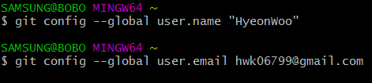  

* 다음과 같이 Git에서 사용할 텍스트 편집기를 고른다.  
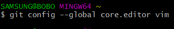
* git config --list 명령을 실행하면 설정한 모든 것을 보여주어 바로 확인할 수 있다.  
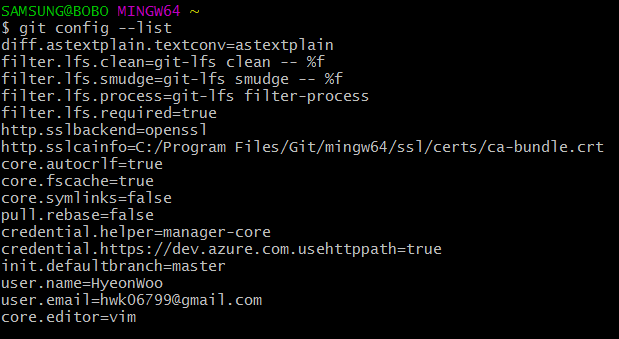  

## 2. 기존 디렉토리를 Git 저장소 만들기 - init

* git init 명령으로 관리할 프로젝트의 디렉토리를 지정한다.  
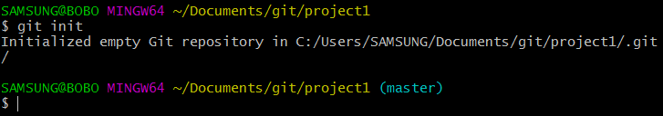  

## 3. 파일 상태 확인하기 - status

* git status 명령으로 파일 상태를 확인할 수 있다.  
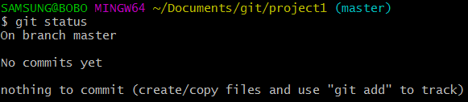  
위의 내용은 파일을 하나도 수정하지 않았다는 것을 말해준다.

## 4. 파일 추적하기 - add

* git add \<파일 이름\> 명령으로 파일을 추적할 수 있다.  
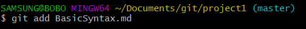  

## 5. 변경사항 커밋하기 - commit

* git commit 명령으로 변경사항을 커밋할 수 있다.  
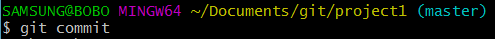    
위 명령을 입력하면 Git 설정에 지정된 편집기가 실행되고, 커밋한 내용을 쉽게 기억할 수 있도록 메세지를 포함할 수 있다. 다음은 'Version1'이라고 내용을 추가로 입력한 것이다.
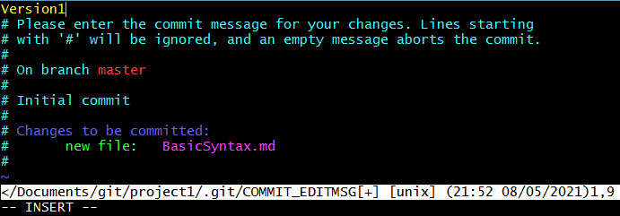  

## 6. 커밋 히스토리 조회하기 - log

* git log 명령으로 커밋 히스토리를 조회할 수 있다.  
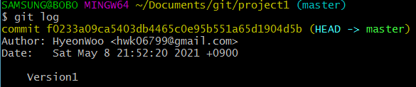  

## 7. 리모트 저장소 추가히기 - remote
* git remote add \<단축이름\> \<url\> 명령으로 리모트 저장소를 추가할 수 있다.  
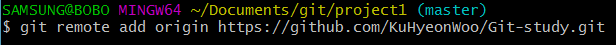  
* git remote -v 명령으로 리모트 저장소의 단축이름과 url을 확인할 수 있다.  
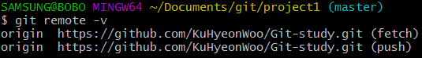  

## 8. 리모트 저장소에 Push 공유하기 - push

* git push \<리모트 저장소 이름\> \<브랜치 이름\> 명령으로 원격 저장소에 브랜치를 push할 수 있다. 브랜치를 따로 만들지 않았으므로 현재 브랜치는 master이다.  
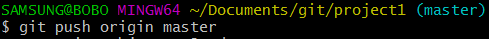   
위 명령으로 Github 사이트에 master 브랜치가 생겼다. 여기에 커밋한 내용이 저장되어있다.
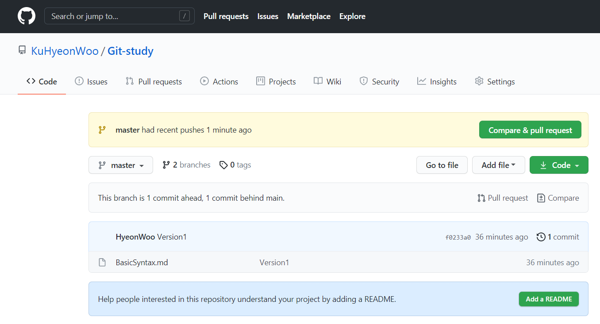  

## 9. 파일 수정 후 변경사항 저장하기 - add, commit, push  

* 파일 수정 후 다시 리모트 저장소에 커밋한 내용을 저장하기 위해선 add, commit, push 명령을 다시 수행해야 한다.

## 10. 기존 저장소를 복제하기 - clone  

* 다른 컴퓨터에서 동일한 프로젝트를 계속하게 되었다고 하자.
* git clone \<url\> \<디렉토리 이름\> 명령으로 저장소를 Clone 할 수 있다. 디렉토리가 새로 만들어지고 그 안에 저장소의 데이터가 모두 복사된다.  
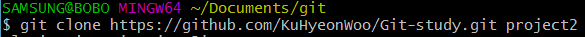  

## 11. 브랜치 생성하기 - branch

* git branch <브랜치 이름> 명령으로 새 브랜치를 생성할 수 있다.  
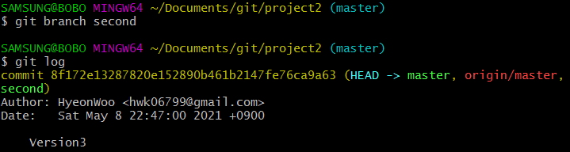  
새로 만든 브랜치도 지금 작업하고 있던 마지막 커밋을 가리킨다.  

## 12. 브랜치 이동하기 - checkout

* git checkout <브랜치 이름> 명령으로 브랜치를 이동할 수 있다.  
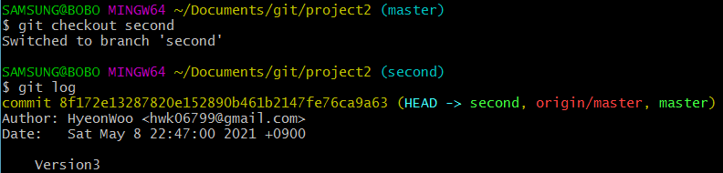  
* 위 명령 후 새로 커밋을 하면 second 브랜치는 새 커밋을 가리키나, master 브랜치는 여전히 이전 커밋을 가리킨다.  
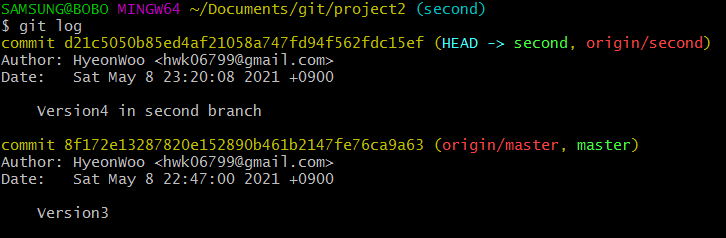  
* git checkout <커밋 아이디> 명령으로 커밋을 이동할 수도 있다.  
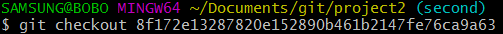  

## 13. 커밋 지우고 이전으로 돌아가기 - reset --hard

* git reset --hard <커밋 아이디> 명령을 이용하면 head가 해당 커밋을 가리키게 되고, 그 이후 커밋은 지워진다.

## 14. 리모트 저장소에서 변경사항 불러오기 - pull

* git pull <리모트 저장소 이름> <브랜치 이름> 명령으로 리모트 저장소에 있는 커밋을 불러올 수 있다.

## 15. 합병하기 - merge

* git merge <브랜치 이름> 명령으로 명령문에 쓰여진 브랜치의 변경사항이 현재 브랜치에 적용된다.  
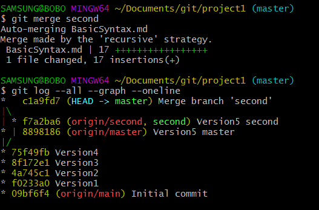  
* git log --all --graph --oneline 명령으로 병합된 것을 쉽게 파악할 수 있다.

## 16. rebase

* git rebase <브랜치 이름> 명령을 쓰면 현재 브랜치가 명령문의 브랜치에서 이어져 수정된 것처럼 바뀐다.

## 17. 태그

* git tag -a v1.4 -m "MESSAGE" 명령을 쓰면 현재 커밋에 메세지와 함께 태그를 붙일 수 있다.

